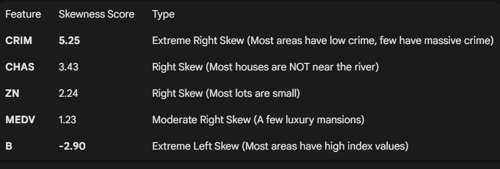

1) As the number of room in the house increase the price also increase but there is also outliers where a house of 6 Room also cost 70MEDV might be depending on another factor. 

2) There is skewness in the data as:

Right Skewed (Positive): The "tail" is on the right side. Most data points are small, but a few very large values pull the average up. (e.g., CRIM or ZN).

Left Skewed (Negative): The "tail" is on the left side. Most data points are large, but a few small values pull the average down. (e.g., B or PTRATIO).

Normal Distribution: Symmetrical, like a bell curve.

